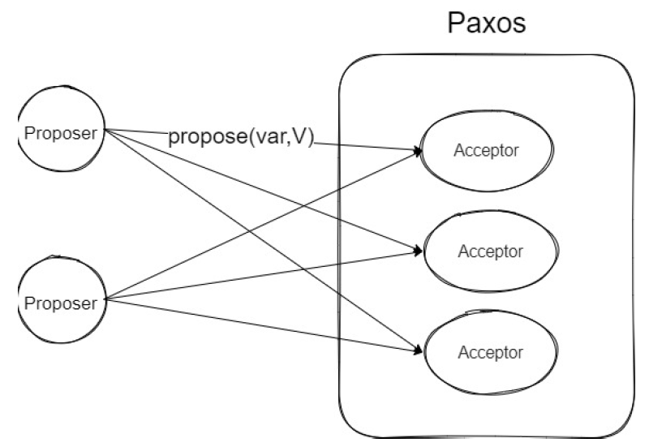
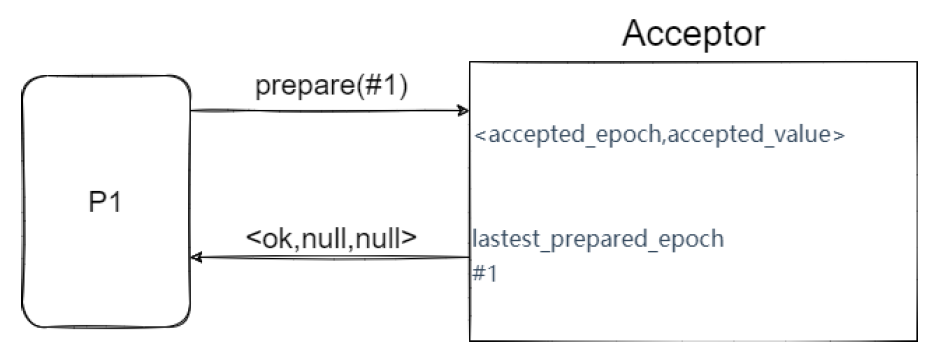
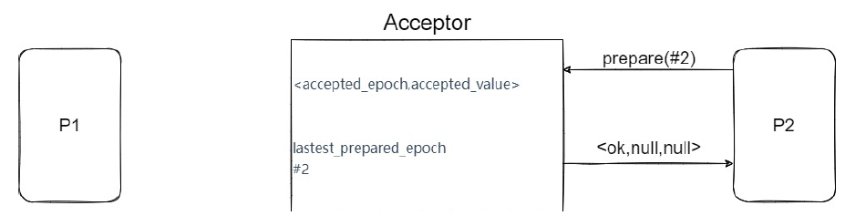
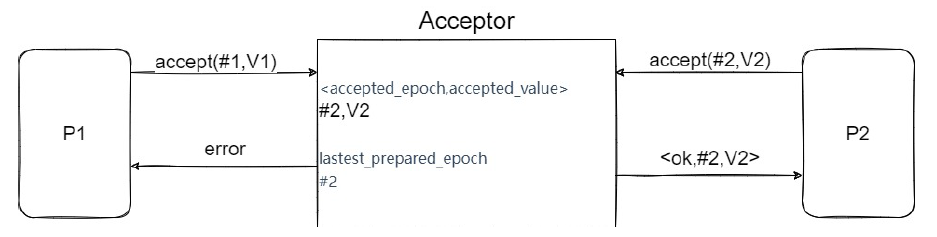
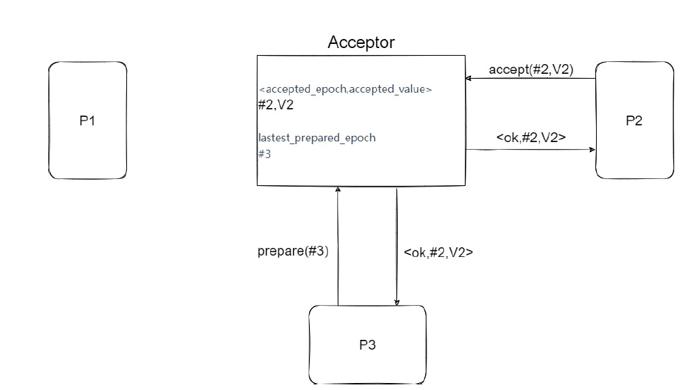
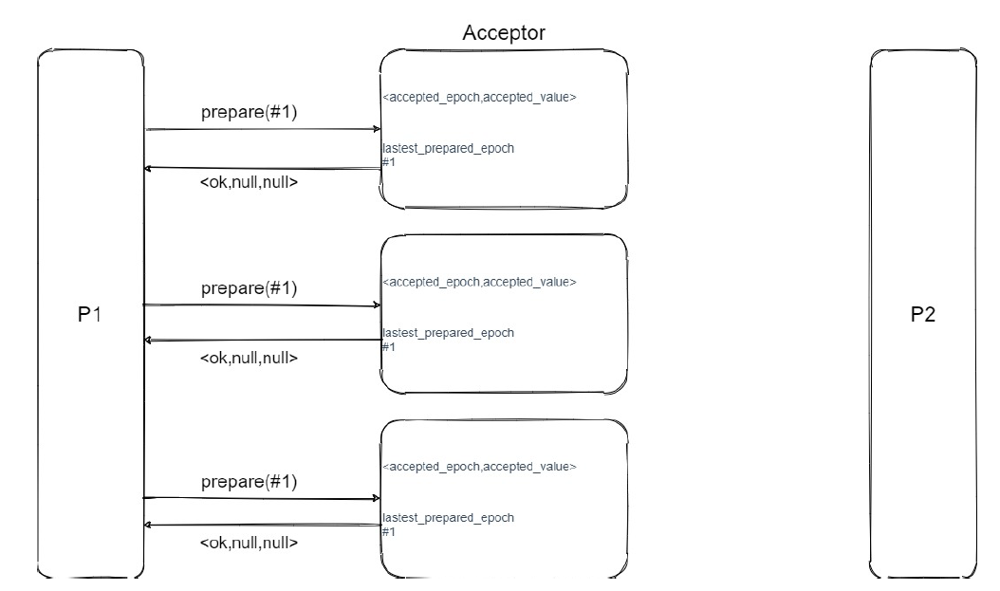
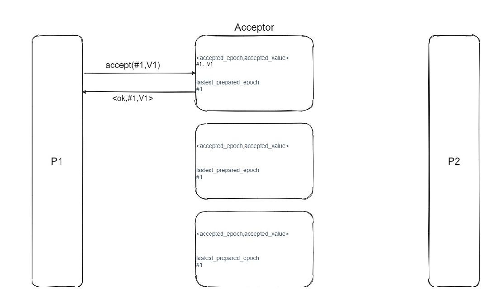
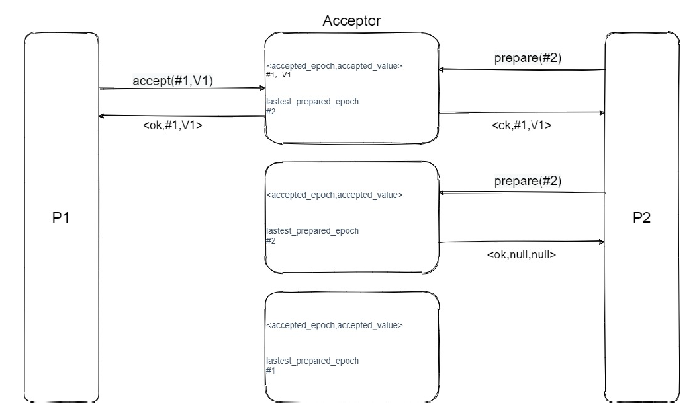
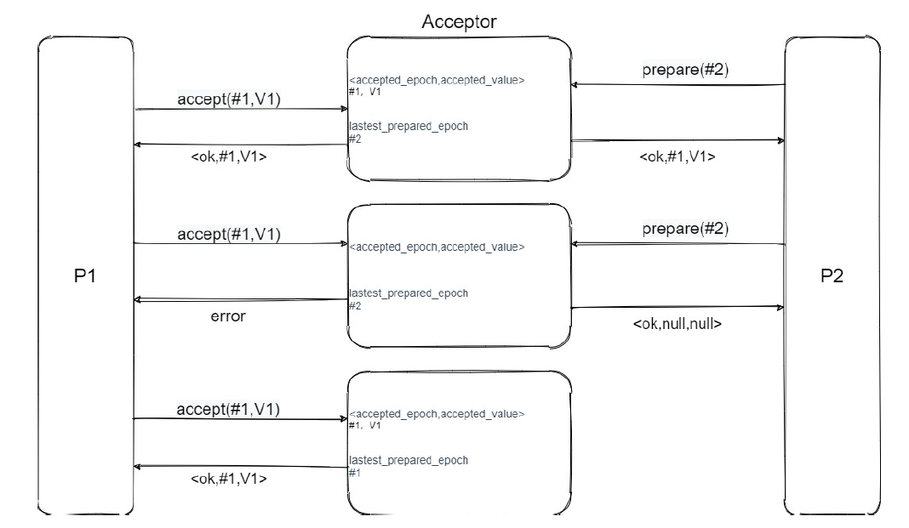
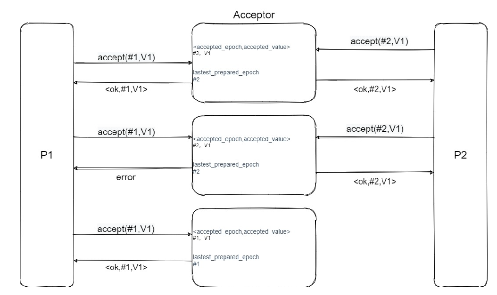

##  Paxos的理解困境

  曾经有个很牛逼的大佬说，这个世界上只有一种一致性算法，那就是Paxos，其它的算法都是残次
品。

  基于Paxos的算法变种有ZAB、Raft。

###  Paxos究竟在解决什么问题？

Paxos用来确定一个不可变变量的取值

- 取值可以是任意的二进制数据。

- 一旦确定将不再更改，并且可以被获取到（不可变性、可读取性）。

  > - 系统有多个存储的节点，这些节点之间的数据要保持一致。
  > - 系统有多个写入的节点，这些写入的节点会存在并发，如何确定由哪个节点写入？
  > - 多个写入节点可能会出现故障.
  > - 多个存储节点也可能出现故障，但是要保证半数以上的存储节点是可用并且值是一致
  >   的。

写入的节点称为proposer，决定写入数据的节点称为acceptor。

###  Paxos如何在分布式存储系统中应用？

- 数据本身可变，采用多副本的方式进行存储
- 多个副本的更新操作序列[Op1,Op2,Op3,...,Opn]是相同的、不变的。
- 用Paxos依次来确定不可变变量Opi的取值（即第i个操作是什么）。
- 每确定完Opi之后，让各个数据副本执行Opi，依次类推。
- Google的Chubby ['tʃʌbi] 等都采用了Paxos来对数据副本的更新序列达成一致。

###  Paxos算法的核心思想是什么？

#### 设计一个系统，来存储名称为var的变量

- 系统内部由多个Acceptor组成，负责存储和管理var变量。
- 外部有多个proposer机器任意并发调用API，向系统提交不同的var取值。
- var的取值可以是任意的二进制数据
- 系统对外的API库接口为：` propose(var,V)=><ok,f>or<error>` ，proposer机器向系统发出请求，希望把var设置成V，系统会返回ok和**系统内部已经确定下来的取值**，或者返回error，如果说系统内部将这个值设置成V，那么f就是V，否则f就是其他proposer设置成的结果。

这个时候我们对于这个系统的初步印象可以是这样的，不一定是对的。

####  系统需要保证var的取值满足一致性

那么就会要求

- 如果var的取值还没确定，则var的取值为null。

- 一旦var的取值被确定，则不可被更改，并且可以一直取到这个值。

####  系统需要满足容错特性

-  可以容忍任意proposer机器出现故障。
-  可以容忍少数Acceptor故障（少于半数）。
####  为了讲解简单，暂不考虑
- 网络分化。
- Acceptor故障会丢失var的信息。

#### 确定一个不可变变量——难点
- 管理多个Proposer的并发执行
- 保证var变量的不可变性
- 容忍任意Propose机器故障
- 容忍半数以下Acceptor机器故障

##### 确定一个不可变变量的取值——方案1

- 先考虑系统由单个Acceptor组成。通过类似互斥锁机制，**来管理并发的proposer运行**。
- Proposer首先向acceptor申请acceptor的互斥访问权，然后才能请求acceptor接受自己的取值。
- acceptor给proposer发放互斥访问权，谁申请到互斥访问权，就接收谁提交的取值。
- 这样的话，就可以让proposer按照获取互斥访问权的顺序依次访问acceptor。
- 一旦acceptor接收了某个proposer的取值，则认为var的取值被确定，其他proposer不再更改。

#####  方案1——基于互斥访问权的acceptor的实现

- acceptor保存变量var和一个互斥锁lock
- acceptor::prepare():
  - 加互斥锁，给予var的互斥访问权，并且返回var当前的取值f。
- acceptor::release():
  - 解互斥锁，收回var的互斥访问权。
- acceptor::accept(var,V):
  - 如果已经加锁，并且var没有确定值，则设置var为V。并且释放锁。

#####  方案1——propose(var,V)的两阶段实现

- 第一阶段：通过acceptor::prepare获取互斥访问权和当前var的取值。
- 如果不能，返回error，代表锁已经被别人占用了。
- 第二阶段：根据当前var的取值f，执行选择。
- 如果f为null，则通过acceptor::accept(var,V)来提交数据V。
- 如果f不为空，则通过acceptor::release()释放访问权，返回<ok,f>。这代表当前proposer想要修改历史的var的取值，根据一致性原则，之前确定下来的值不改，返回已经确定的取值。

#####  方案1——总结

- 通过acceptor互斥访问权让proposer序列运行，可以简单的实现var取值的一致性。
- proposer在释放互斥访问权之前发生故障，会导致系统陷入死锁。
  - 不能容忍任意的Proposer机器故障。

#####  方案2——引入抢占式访问权

方案1我们看起来就是因为死锁的问题导致不够完善，那么我们怎么解决死锁问题呢？

- acceptor可以让某个proposer获取到的访问权失效，不再接收它的访问。
- 之后，可以将访问权发放给其他proposer，让其他proposer访问acceptor。

那么对于acceptor来说，它就只需要记录下最新发放的访问权就行了。新的有用，旧的不行。可是要怎么判断新旧呢？

- Proposer向acceptor申请访问权时指定编号epoch */ˈiː.pɒk/* （越大的epoch越新），获取到访问权之后，才能向acceptor提交取值。
- acceptor采用**喜新厌旧**的原则。
  - 一旦收到更大的新epoch的申请，马上让旧epoch的访问权失效，不再接收他们提交的取值。
  - 然后给新epoch发放访问权，只接收新epoch提交的取值。
- **新epoch可以抢占旧epoch，让旧epoch的访问权失效。旧epoch的proposer将无法运行，新epoch的proposer将开始运行**。
- 为了保持一致性，不同的proposer之间采用“**后者认同前者**”的原则。
  - 在肯定旧epoch无法生成**确定性取值**时，新的epoch才会提交自己的value。
  - 一旦旧epoch形成确定性取值，新的epoch肯定可以获取到此取值，并且会认同此取值，不会破坏。

#####  方案2——基于抢占式访问权的acceptor的实现

- acceptor保存的状态
  - 当前var的取值<accepted_epoch,accepted_value>
  - 最新发放访问权的epoch(lastest_prepared_epoch)
- acceptor::prepare(epoch):
  - 只接收比lastest_prepared_epoch更大的epoch，并且给予访问权，
  - 记录lastest_prepared_epoch=epoch；然后返回当前var的取值
- acceptor::accept(var,prepared_epoch,V):
  - 验证是否prepared_epoch==lastest_prepared_epoch
    - 假如验证通过，设置var的取值<accepted_epoch,accepted_value>=
      <prepared_epoch,V>
    - 假如不通过，说明已经有了更大的epoch申请到了访问权，当前proposer获
      取到的访问权失效。

##### 方案2——propose(var,V)的两阶段实现

- 第一阶段：通过acceptor::prepare获取互斥访问权和当前var的取值。

  - 我们可以简单地以当前时间戳为epoch，通过acceptor::prepare(epoch)，获取epoch轮次的访问权和当前var的取值。
  - 如果不能获取，返回error。说明当前已经有个相同或者更大的epoch获取到了访问
    权。
  
- 第二阶段：采用“后者认同前者”的原则执行。

> - 在肯定旧epoch无法生成确定性取值时，新的epoch才会提交自己的value。
>
> -  一旦旧epoch形成确定性取值，新的epoch肯定可以获取到此取值，并且会认同此取值，不会破坏。

- 如果var的取值为空，则肯定旧epoch无法生成确定性取值，则通过
  acceptor::accept(var,prepared_epoch,V)提交数据V。成功后返回<ok,V>
- 如果accept失败，返回error。（被新的epoch抢占或者acceptor故障）
  
- 如果var的取值存在，则此取值肯定是确定性取值，此时认同它不再更改，直接返回<ok,accepted_value>。

画图来说明下，Proposer1向acceptor发送访问权申请

Proposer2向acceptor发送访问权申请

Proposer2拿到了访问权，向acceptor提交自己的数据。且之后Proposer1向acceptor提交自己的
数据。

再之后proposer3向acceptor发送访问权申请。

因为这个时候已经有确定性取值了，proposer3会认可这个值，不再进行修改。

#####  方案2——总结

- 基于抢占式访问权的核心思想
  - 让Proposer将按照epoch递增的顺序抢占式的依次运行，后者会认同前者。
- 可以避免proposer机器故障带来的死锁问题，并且仍可以保证var取值的一致性。
- 仍需要引入多acceptor
  - 单机模块acceptor故障将会导致整系统宕机，无法提供服务。

####  思考——关于方案1和2

- 方案1
  - 如何控制proposer的并发运行？
  - 为何可以保证一致性？
  - 为什么会有死锁问题？
- 方案2
  - 如何解决方案1的死锁问题？
  - 在什么情况下，proposer可以将var的取值确定为自己提交的取值？
  - 如何保证新epoch不会破坏已经达成的确定性取值？

###  Paxos

-----

- Paxos在方案2的基础上引入多acceptor。
  acceptor的实现保持不变，仍然采用“喜新厌旧”的原则运行。
- Paxos采用了少数acceptor服从多数的思路（**少数服从多数**）。
- 在方案2中，一旦某个epoch的取值f被系统里仅有的acceptor接受，那么我们就认为var的取值被确定了。那么在Paxos中，我们定义，**一旦某epoch的取值f被半数以上acceptor接受，则认为此取值被确定为f**，不再更改。

####  Acceptor的实现不变

####  Propose的两阶段实现

propose(var,V)第一阶段：选定epoch，获取epoch访问权和对应var的取值。

- 获取半数以上acceptor的访问权和对应的一组var取值。 因为半数以上和半数以上必然存在交集，那么就可以保证，一个epoch最多只会有一个proposer拿到访问权，进入第二阶段运行。

propose(var,V)第二阶段：采用后者认同前者的原则执行。

> - 在肯定旧epoch无法生成确定性取值时，新的epoch才会提交自己的value。
> -   一旦旧epoch形成确定性取值，新的epoch肯定可以获取到此取值，并且会认同此取值，
>     不会破坏。

- 如果proposer在第一阶段获取到的var取值都为空，则旧epoch无法形成确定性取值。此时努力使<epoch,V>成为确定性取值。
  - 向所有的epoch对应的所有acceptor提交取值<epoch,V>。
  - 如果收到半数以上成功，则返回<ok,V>。
  - 否则，则返回error（被新的epoch抢占或者accepor故障）。

- 如果说var的取值存在，那么就要认同最大accepted_epoch对应的取值f，努力使<epoch,f>成为确定性取值。
  - 如果f已经出现了半数以上，则说明f已经是确定性取值，直接返回<ok,f>
  - 如果说f只是出现了半数以下，那此时f可能是确定性取值，也可能不是，不管怎样，此时的epoch都会认同这个f，向所有的acceptor提交这个取值<epoch,f>

​    我们想象一下，当proposer1提交的<epoch1,f>被acceptor接受，epoch1形成了确定性取值，紧接着下一个就是proposer2的提交的epoch2，proposer2肯定是可以获取到至少一个确定性取值<epoch1,f>，并且在epoch2获取到的所有取值里面，epoch1是一个最大的epoch，所以epoch2会认可epoch1提交的取值f，以此类推，后面的epoch也都会认可epoch1提交的取值f，不会进行更改。

​    画图讲解下第一阶段

​    proposer1向所有的acceptor发出prepare请求，并且返回var的当前取值，全部为空。
​    proposer1发现所有的取值为空，这个时候proposer1就可以选定自己的取值V1为确定性取值向所有的acceptor发送accept请求。proposer1进入第二阶段，向第一个acceptor发出请求。

​    在这个时候，P2进入第一阶段，向acceptor发出prepare请求。使用epoch2企图抢占访问权。P2向前两个acceptor发出了prepare请求。

​    epoch1的访问权直接失效，epoch2获取到了访问权，acceptor向P2返回了节点当前保存的结果。P2进入了第二阶段，在P2发起accept请求之前，P1继续向另外的两个节点发送accept请求。

​    在这个情况中，第二个acceptor会拒绝P1的请求，因为epoch1访问权失效，第三个acceptor接受了V1这个取值并且返回成功。这个时候，epoch1已经形成了确定性取值V1，也是P1的取值V1。
​    这个时候，P2开始在第二阶段向acceptor发起accept请求。它选定取值里面最大的epoch的取值，也就是epoch1提交的V1，然后开始让acceptor接受V1。

​    所以在这种情况下，我们可以看到P2也形成了确定性取值V1，因为它是直接选择epoch1提交的取值V1，所以即使epoch1和epoch2都形成了确定性取值，这两个取值不会发生冲突。
​    我们可以假设，P1的后两个accept请求没有成功发出去，那么epoch1无法形成确定性取值，epoch2也会照样选择V1来形成确定性取值，也不会形成冲突。

####  Paxos——总结

#####  Paxos算法的核心思想

- 在抢占式访问权的基础上引入多个acceptor

- 保证一个epoch，只有proposer运行，proposer按照epoch递增的顺序依次运行。

- 新epoch的proposer采用“后者认同前者”的思路运行。

  - 在肯定旧epoch无法生成确定性取值时，新的epoch才会提交自己的value。
  - 一旦旧epoch形成确定性取值，新的epoch肯定可以获取到此取值，并且会认同此取
    值，不会破坏。

#####  Paxos算法可以满足容错性要求

- 半数以下acceptor出现故障时，存活的acceptor仍然了可以生成var的确定性取值。
-   一旦var取值被确定，即使出现了半数以下acceptor故障，该取值也可以被获取，并且不再更改。
#####  Paxos算法的livelock问题

- 新轮次的抢占会让旧轮次停止运行，如果每一轮次在第二阶段成功之前都被新一轮次抢占，则
导致活锁，怎么解决呢？

###  思考题

------
1. 在什么情况可以认为var的取值被确定，不再更改？
2. Paxos的两个阶段分别在做什么？
3. 一个epoch是否会有多个proposer进入第二阶段？
4. 在什么情况下，proposer可以将var的取值确定为自己提交的取值呢？
5. 在第二阶段，如果获取的var取值都为空，为什么可以保证旧epoch无法形成确定性取值？
6. 新epoch抢占成功之后，旧epoch的proposer将如何运行？
7. 如何保证新的epoch不会破坏已经达成的确定性取值？
8. 为什么在第二阶段存在var取值时，只需要考虑accepted_epoch最大的取值f？
9. 在形成确定性取值之后，出现了任意半数以下acceptor故障，为何确定性取值不会被更改？
10. 如果proposer在运行过程中，任意半数以下的acceptor出现故障，此时将如何运行？
11. 正在运行的proposer和任意半数以下acceptor都出现故障时，var的取值可能是什么情况？为
何之后新的proposer可以形成确定性取值？

###  参考资料

[分布式系列文章——Paxos算法原理与推导](https://www.cnblogs.com/linbingdong/p/6253479.html)
