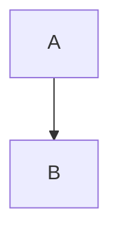

## 标题
Markdown支持6种级别的标题，对应html标签 h1 ~ h6
```
# 一级标题
## 二级标题
### 三级标题
#### 四级标题
##### 五级标题
###### 六级标题

```
## 链接或图片
```
插入链接：[点击跳转到百度](http://www.baidu.com)
插入图片：
```
效果：
[点击跳转到百度](http://www.baidu.com)


## 列表
- 无序列表用 **-** 标识
1. 有序列表用 **1.** 标识
```
- 无序列表1
- 无序列表2

1. 有序列表1
2. 有序列表2
```
效果：
- 无序列表1
- 无序列表2

1. 有序列表1
2. 有序列表2
## 引用
```
> 引用段落
```
> 引用段落

### 嵌套
```
> 这段文字将被高亮显示...
>> 这段文字将被高亮显示...
>>> 这段文字将被高亮显示...
>>>> 这段文字将被高亮显示...  以此类推

- 列表嵌套引用段
>     引用
>>     引用 

> 引用段嵌套列表
> - 嵌套列表
> - 嵌套列表

```
效果：

> 这段文字将被高亮显示...
>> 这段文字将被高亮显示...
>>> 这段文字将被高亮显示...
>>>> 这段文字将被高亮显示...  以此类推

- 列表嵌套引用段
>     引用
>>     引用 

> 引用段嵌套列表
> - 嵌套列表
> - 嵌套列表

## 分割线
三个***，或者---

效果：
***
---
## 文本强调
加粗、斜体、高亮标记、删除线

```
*这里是斜体*
_这里是斜体_

**这里是加粗**
__这里是加粗__

==这里是标记==

~~这里是删除~~
```
效果：

*这里是斜体*
_这里是斜体_

**这里是加粗**
__这里是加粗__

==这里是标记==

~~这里是删除~~
## 复选框
复选框也可以叫任务列表，有完成和未完成的状态（打钩和空白）。
在无序列表符号后面加上[]或者[x]代表选中或者未选中情况。
```
- [ ] 任务一
- [x] 任务二 
```
- [ ] 任务一
- [x] 任务二 
## 代码
行内代码：用一个或两个反引号\`包裹
```
`行内代码`
```
代码段：用3个反引号\`包裹
```
```代码段```
代码段
```代码段```

```
## 表格
```
表头|条目一|条目二
:---:|:---:|:---:
项目|项目一|项目二

```
三个短斜杠左右的冒号用于控制对齐方式，只放置左边冒号表示文字居左，只放置右边冒号表示文字居右，如果两边都放置冒号表示文字居中。

表头|条目一|条目二
:---:|:---:|:---:
项目|项目一|项目二

## 特殊符号处理
在内容中输入以下特殊符号的时候一定要注意转义，否则将导致内容显示不全，甚至排版混乱。使用 \\ 进行转义处理。
```
\   反斜线
`   反引号
*   星号
_   底线
{}  花括号
[]  方括号
()  括弧
#   井字号
+   加号
-   减号
.   英文句点
!   惊叹号
```
## 字体颜色、大小
```
<font face="黑体">我是黑体字</font>
<font face="微软雅黑">我是微软雅黑</font>
<font face="STCAIYUN">我是华文彩云</font>
<font color=red>我是红色</font>
<font color=#008000>我是绿色</font>
<font color=Blue>我是蓝色</font>
<font size=5>我是尺寸</font>
<font face="黑体" color=green size=5>我是黑体，绿色，尺寸为5</font>

```
<font face="黑体">我是黑体字</font>

<font face="微软雅黑">我是微软雅黑</font>

<font face="STCAIYUN">我是华文彩云</font>

<font color=red>我是红色</font>

<font color=#008000>我是绿色</font>

<font color=Blue>我是蓝色</font>

<font size=5>我是尺寸</font>

<font face="黑体" color=green size=5>我是黑体，绿色，尺寸为5</font>
## 流程图

