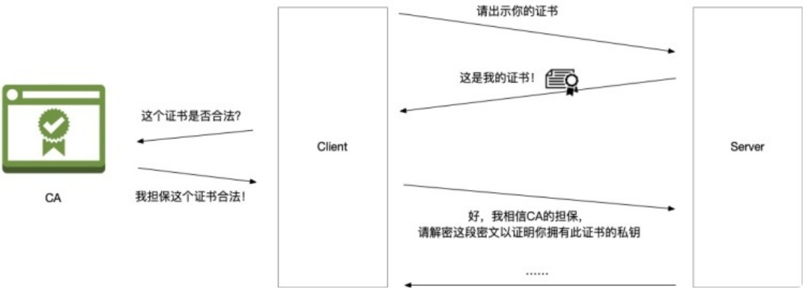
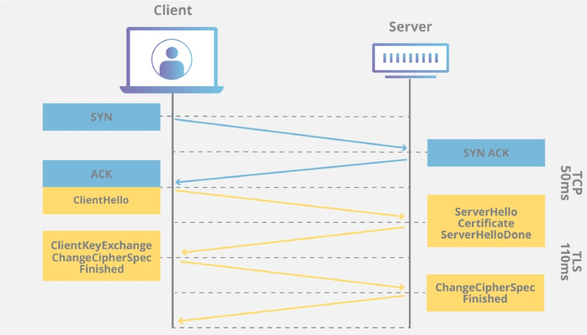
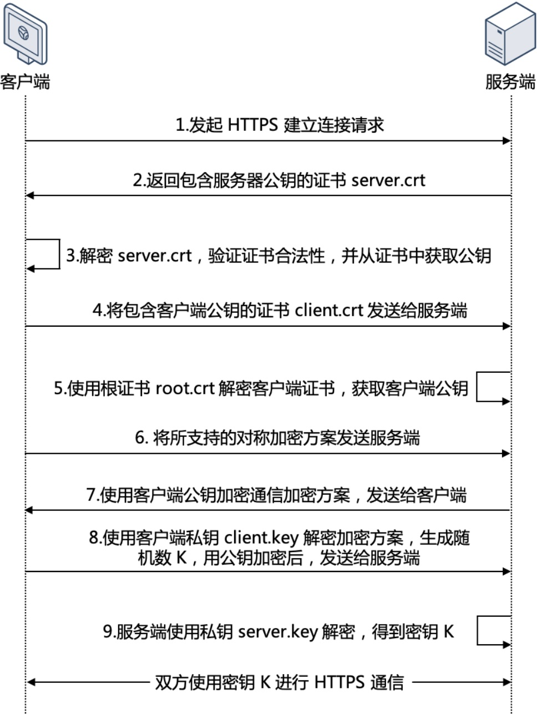
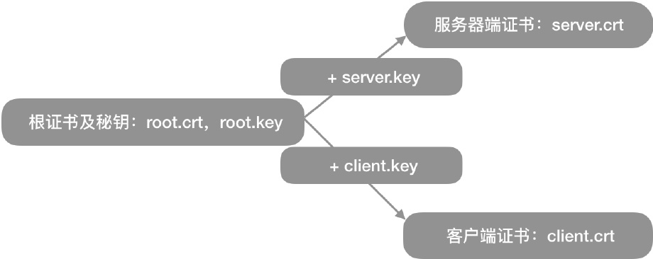
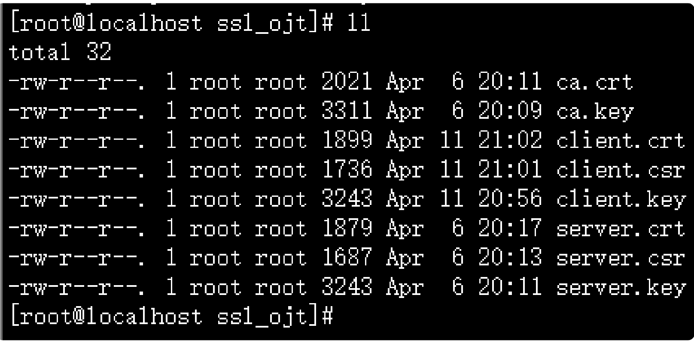
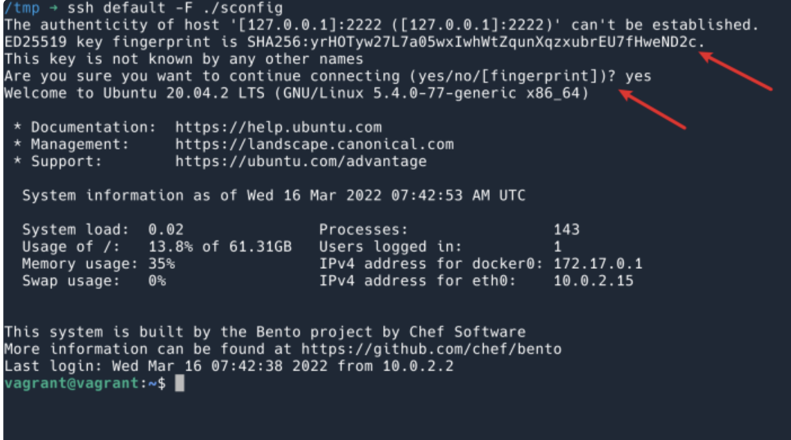
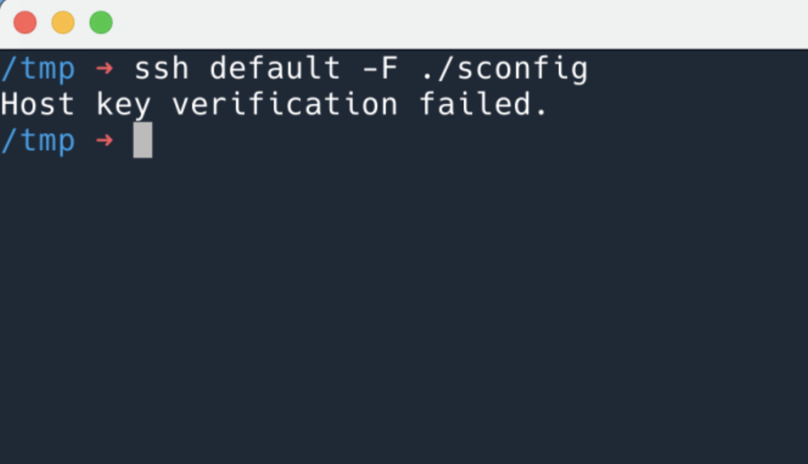
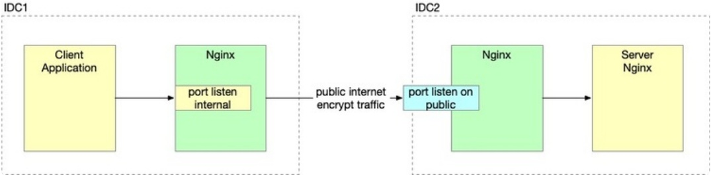

# HTTPS与双向认证


## 1 TLS/SSL原理
TLS 是加密传输数据，保证数据在传输的过程中中间的人无法解密，无法修改。（本文中[将 TLS 与 SSL 作为同义词](https://www.globalsign.com/en/blog/ssl-vs-tls-difference)。所以提到 SSL 的时候，您可以认为和 TLS 没有区别。）事实上我们现在用的都是 TLS，但因为历史上习惯了SSL这个称呼，所以平常还是以SSL为多。

### 1.1 加密传输的设计
加密传输，并不是很难，比如说双方使用密码加密就行。这样一来，就遇到了一个问题，该怎么协商这个密码。显然使用固定的密码是不行的，比如每个人都要访问一个网站，如果网站使用固定的密码，那么和没有密码也没有什么区别了，每个人都可以使用这个密码去伪造网站。

## 2 TLS要解决什么问题
TLS 要解决的问题就是，能证明你，是你。现在使用的是非对称加密的技术。非对称加密会有两个秘钥，一个是公钥，一个是私钥。公钥会放在互联网上公开，私钥不公开，只有自己知道。只有你有私钥，我才相信你是你。非对称加密的两个秘钥提供了一下功能（本文不会详细介绍这部分原理，只简单提到理解后续内容需要的知识）：
1. 公钥加密的数据，只有用私钥可以解密；
2. 私钥可以对数据进行签名，公钥拿到数据之后可以验证数据是否由私钥的所有者签名的。
   
老规矩，一定要记清楚这两个设定。

### 2.1 TLS的大致流程
有了这两点，网站就可以和访问者构建一个加密的数据通道。首选，网站将公钥公开(即我们经常说的“证书”)，访客连接到网站的服务器第一件事就是下载网站的证书。因为证书是公开的，每个人都能下载到此网站的证书，那么怎么确定对方就是此证书的所有者呢？客户端会生成一个随机数，并使用公钥进行加密，发送给服务器：请解密这段密文。这就是上文提到的 功能1，即公钥加密的数据，只有私钥才能解密。服务器解密之后发回来(当然，并不是明文发回来的，详细的 TLS 握手过程，⻅[这里](https://www.cloudflare.com/zh-cn/learning/ssl/what-happens-in-a-tls-handshake/)，客户端就相信对方的确是这个证书的所有者。后续就可以通过非对称加密协商一个密码，然后使用此密码进行对称加密传输(性能快)。

## 3 这样就是安全的吗？——CA机构
但是这样就足够验证对方身份了吗？假设这样一种情况，我并不是 google.com 这个域名的所有者，但是我生成了一对证书，然后自己部署，将用户访问 google.com 的流量劫持到自己这里来，是不是也能使用自己的证书和用户进行加密传输呢？所以就有了另一个问题：访客不仅要验证对方是证书的真实所有者，还要验证对方的证书的合法性。即google.com 的证书只有 Google 公司可以拥有。私自签发的证书不合法。为了解决这个问题，就需要有一个权威的机构，做如下的保证：只有网站的所有者，才能拥有网站的证书。然后访客只要信任这个“权威的机构”就可以了。



CA 的全称是 Certification Authority, 是一个第三方机构，在上述加密的流程中，扮演的⻆色同时被访客和网站所信任。网站需要去 CA 申请证书，而 CA 要对自己颁发（签名）的证书负责，即确保证书颁发给了对方，颁发证书之前要验证你是你。申请证书的时候，CA 一般会要求你完成一个 Challenge 来证明身份，比如，要求你将某个 URL 返回特定内容，或者要求你将 DNS 的某个 text record 返回特定内容来证明你的确拥有此域名（详⻅ [validation standards](https://en.wikipedia.org/wiki/Certificate_authority#Validation_standards)）。只有你证明了你是你，CA 才会签证书给你。

### 3.1 访客是怎么验证证书？
记住上面的设定2，
> 2.私钥可以对数据进行签名，公钥拿到数据之后可以验证数据是否由私钥的所有者签名的。

CA 也有自己的一套私钥公钥，CA 使用私钥对网站的证书进行签名（担保），访客拿到网站的证书之后，使用 CA 的公钥校验签名即可验证这个“担保”的有效性。

那么 CA 的公钥是怎么来的呢？答案是直接存储在客户端的。Linux 一般存储在 /etc/ssl/certs 。由此可⻅，CA 列表更新通常意味着要升级系统，一个新的 CA 被广泛接受是一个漫⻓的过程。新 CA 签发的证书可能有一些老旧的系统依然不信任。比如 [letsencrypt 的 CA](https://letsencrypt.org/docs/dst-root-ca-x3-expiration-september-2021/)，之前就是使用交叉签名的方式工作，即已有的 CA 为我做担保，我可以给其他的网站签发证书。这也是中级证书的工作方式。每天有这么多网站要申请证书，CA 怎么签发的过来呢？于是 CA 就给很多中级证书签名，中级证书给网站签名。这就是“信任链”。访客既然信任 CA，也就信任 CA 签发的中级，也就信任中级签发的证书。被信任很漫⻓，被不信任很简单。

CA （以及中级证书机构）有着非常大的权利。举例，CA 假如给图谋不轨的人签发了 Google 的证书，
那么攻击者就可以冒充 Google。即使 Google 和这个 CA 并没有任何业务往来，但是自己的用户还是被
这个 CA 伤害了。所以 CA 必须做好自己的义务：
1. 保护自己的私钥不被泄漏；
2. 做好验证证书申请者身份的义务；
3. 如果 (2) 有了疏忽，对于错误签发的证书要[及时吊销](https://en.wikipedia.org/wiki/OCSP_stapling)；

### 3.2 TLS的单向认证(握手)过程
TLS 握手是由客户端和服务器交换的一系列数据报或消息。TLS 握手涉及多个步骤，因为客户端和服务器要交换完成握手和进行进一步对话所需的信息。

TLS 握手的确切步骤将根据所使用的密钥交换算法的类型以及双方支持的密码套件而有所不同。RSA 密钥交换算法最为常用。具体如下：



1. “客户端问候（client hello）” 消息： 客户端通过向服务器发送“问候”消息来开始握手。该消息将包含客户端支持的 TLS 版本，支持的密码套件，以及称为一串称为“客户端随机数（client random）”的随机字节。
2. “服务器问候（server hello）”消息： 作为对 client hello 消息的回复，服务器发送一条消息，内含服务器的 SSL 证书（server.crt）、服务器选择的密码套件，以及“服务器随机数（server random）”，即由服务器生成的另一串随机字节。
3. 身份验证： 客户端使用颁发该证书的证书颁发机构验证服务器的 [SSL 证书](https://www.cloudflare.com/zh-cn/learning/ssl/what-is-an-ssl-certificate/)。此举确认服务器是其声称的身份，且客户端正在与该域的实际所有者进行交互。
    - 检查证书是否过期。
    - 检查证书是否已经被吊销。
    - 检查证书是否可信。
    - 检查收到的证书中的域名与请求的域名是否一致。
4. 预主密钥： 客户端再发送一串随机字节，即“预主密钥（premaster secret）”。预主密钥是使用公钥加密的，只能使用服务器的私钥解密。（客户端从服务器的 SSL 证书中获得[公钥](https://www.cloudflare.com/zh-cn/learning/ssl/how-does-public-key-encryption-work/)。）
5. 私钥被使用：服务器对预主密钥进行解密。
6. 生成会话密钥：客户端和服务器均使用客户端随机数、服务器随机数和预主密钥生成会话密钥。双方应得到相同的结果。
7. 客户端就绪：客户端发送一条“已完成”消息，该消息用会话密钥加密。
8. 服务器就绪：服务器发送一条“已完成”消息，该消息用会话密钥加密。
9. 实现安全对称加密：已完成握手，并使用会话密钥继续进行通信。


## 4 HTTPS双向认证
从上文中，我们就可以使用客户端与服务端建立起一个安全的加密通道。但是在一些特殊的场景，我们需要对客户端的身份做验证，比如一些金融交易等场景。在我看来，HTTPS双向认证就是基于同个CA签发了两套公钥证书，以这个CA为双方的身份担保。

一般双向认证的时候，我们会使用自签名证书，因为不花钱，方便。

### 4.1 双向认证的流程
SSL 双向认证需要验证客户端和服务端的身份。SSL 双向认证的流程如下图所示。



1. 客户端发起 HTTPS 建立连接请求，将客户端支持的 SSL 协议版本号、加密算法种类、生成的随机数等信息发送给服务端。
2. 服务端向客户端返回 SSL 协议版本号、加密算法种类、生成的随机数等信息，以及服务端的证书（server.crt）。
3. 客户端验证证书（server.crt）是否合法，并从此证书中获取服务端的公钥：
    - 检查证书是否过期。
    - 检查证书是否已经被吊销。
    - 检查证书是否可信。
    - 检查收到的证书中的域名与请求的域名是否一致。
4. 服务端要求客户端发送客户端的证书（client.crt），客户端将自己的证书发送至服务端。
5. 服务端验证客户端的证书（client.crt），验证通过后，服务端使用根证书（root.crt）解密客户端证书，然后获取客户端的公钥。
6. 客户端向服务端发送自己所支持的对称加密方案。
7. 服务端从客户端发送过来的对称加密方案中，选择加密程度最高的加密方式，并使用客户端公钥加密后，返回给客户端。
8. 客户端使用客户端的私钥（client.key）解密加密方案，并生成一个随机数（密钥 K），作为通信过程中对称加密的密钥，然后使用服务端证书的公钥进行加密后再发送给服务端。
9. 服务端收到客户端发送的加密信息后，使用服务端的私钥（server.key）进行解密，获取对称加密密钥（密钥 K）。在接下来的会话中，客户端和服务端将会使用该对称加密密钥（密钥 K）进行通信，保证通信过程中信息的安全。

### 4.2 怎么自签双向认证的证书
从上面的内容中可以看出，我们至少需要5个证书文件：
- 服务器端公钥证书：server.crt
- 服务器端私钥文件：server.key
- 根证书：root.crt
- 客户端公钥证书：client.crt
- 客户端私钥文件：client.key

再根据之前说的，证书都是由CA颁布的，所以我们现在的⻆色就是CA，身为CA，要有一套CA自己的证书，来代表自己身份。所以我们需要先生成一个CA根证书，然后由这个CA根证书颁发服务器公钥证书和客户端公钥证书。下面是证书生成的内在逻辑示意图：



#### 4.2.1 生成自签名根证书

1. 创建根证书私钥：
```bash
openssl genrsa -des3 -out root.key 4096
```
- `openssl` : cert 和 key 相关的操作我们都用 openssl 来完成；
- `genrsa` : 生成 RSA 私钥；
- `-des3` : 生成的 key，使用 des3 进行加密，如果不加这个参数，就不会提示让你输入密码；
- `4096` : 生成 key 的⻓度；
2. 创建根证书请求文件：
```sh
openssl req -new -out root.csr -key root.key
```
就是说，我们的公钥是怎么出来的呢？

我们要先生成一个请求文件，这个请求文件里包含了我们对要申请的公钥的一些信息:
```sh
Country Name (2 letter code) [XX]:cn
State or Province Name (full name) []:GuangDong
Locality Name (eg, city) [Default City]:Shenzhen
Organization Name (eg, company) [Default Company Ltd]:公司名（英文）
Organizational Unit Name (eg, section) []:QWERTY
Common Name (eg, your name or your servers hostname) []:abc
Email Address []:hahahaha
A challenge password []:
An optional company name []:
```
这时会询问你一些信息，比如地区，组织名字之类的。其中，Organization Name 和 Common Name需要留意。CA 的这一步填什么都可以。Common Name 又简称 CN，就是证书签发给哪一个域名（也可以是 IP）的意思。

3. 创建跟公钥证书
```sh
openssl x509 -req -in root.csr -out root.crt -signkey root.key -
CAcreateserial -days 3650
```
在创建证书请求文件的时候需要注意三点，下面生成服务器请求文件和客户端请求文件均要注意这三点： 
- 根证书的Common Name填写root就可以（看阿里的文档里这么说，我觉得随便填没啥），所有客户端和服务器端的证书这个字段需要填写域名，**一定要注意的是，根证书的这个字段和客户端证书、服务器端证书不能一样**；
- 其他所有字段的填写，根证书、服务器端证书、客户端证书需保持一致。
- 在测试的时候，最后的密码可以直接回⻋跳过，平常线上的话，最好搞个，免得万一私钥泄漏，被人到处拿去签发。

经过上面三个命令行，我们最终可以得到一个签名有效期为10年的根证书root.crt，后面我们可以用这个根证书去颁发服务器证书和客户端证书。

#### 4.2.2 生成自签名服务器端证书
1. 生成服务器端证书私钥：
```sh
openssl genrsa -out server.key 1024
```
2. 生成服务器证书请求文件，过程和注意事项参考根证书，本节不详述
```bash
openssl req -new -out server.csr -key server.key
```
3. 生成服务器端公钥证书
```bash
openssl x509 -req -in server.csr -out server.crt -signkey server.key -CA root.crt -CAkey root.key -CAcreateserial -days 3650
```
经过上面的三个命令，我们得到：
- `server.key` ：服务器端的密钥文件
- `server.crt` ：有效期十年的服务器端公钥证书，使用根证书和服务器端私钥文件一起生成

#### 4.2.3 生成客户端证书
过程同上，不重复赘述。

完成后，我们应该有8个文件

- ca.crt CA的公钥，用来验证CA签发出去的证书
- ca.key CA的私钥，CA的核心资产，需要重点保护
- client.crt 由CA使用CA的私钥以及客户端的证书请求文件签发出来的证书，带公钥
- client.csr 客户端的证书请求文件，后面用不到
- client.key 客户端的私钥
- server.crt 服务器的证书
- server.csr 服务器的证书请求文件，后面用不到
- server.key 服务器的私钥

### 4.3 验证
#### 4.3.1 安装Nginx并配置ssl
使用curl命令加上证书路径，就可以直接nginx的https双向认证是否成功。

yum安装一个nginx，启动，修改配置文件，
```bash
server {
    listen 443 ssl http2;
    listen [::]:443 ssl http2;
    server_name _;
    root /usr/share/nginx/html;

    ssl_certificate "/etc/nginx/key/server.crt";
    ssl_certificate_key "/etc/nginx/key/server.key";
    ssl_session_cache shared:SSL:1m;
    ssl_session_timeout 10m;
    ssl_ciphers HIGH:!aNULL:!MD5;
    ssl_prefer_server_ciphers on;

    # Load configuration files for the default server block.
    include /etc/nginx/default.d/*.conf;
    error_page 404 /404.html;
        location = /40x.html {
    }
    error_page 500 502 503 504 /50x.html;
        location = /50x.html {
    }
}
```
测试一下
```
[root@localhost nginx]# curl -v https://proxy.example.com --resolve proxy.example.com:443:127.0.0.1 --cacert /root/ssl_ojt/ca.crt -o /dev/null
* Added proxy.example.com:443:127.0.0.1 to DNS cache
* About to connect() to proxy.example.com port 443 (#0)
* Trying 127.0.0.1...
% Total % Received % Xferd Average Speed Time Time Time Current Dload Upload Total Spent Left Speed
0 0 0 0 0 0 0 0 --:--:-- --:--:-- --:--:--0
* Connected to proxy.example.com (127.0.0.1) port 443 (#0)
* Initializing NSS with certpath: sql:/etc/pki/nssdb
* CAfile: /root/ssl_ojt/ca.crt
  CApath: none
0 0 0 0 0 0 0 0 --:--:-- --:--:-- --:--:--0
* SSL connection using TLS_ECDHE_RSA_WITH_AES_256_GCM_SHA384
* Server certificate:
* subject: CN=proxy.example.com,O=test,L=Shenzhen,ST=guangdong,C=CN
* start date: Apr 06 12:17:02 2022 GMT
* expire date: May 06 12:17:02 2022 GMT
* common name: proxy.example.com
* issuer:
CN=localhost,OU=haha,O=haha,L=Shenzhen,ST=Guua\08\08angdong,C=CN
> GET / HTTP/1.1
> User-Agent: curl/7.29.0
> Host: proxy.example.com
> Accept: */*
>
< HTTP/1.1 200 OK
< Server: nginx/1.20.1
< Date: Mon, 11 Apr 2022 12:46:03 GMT
< Content-Type: text/html
< Content-Length: 4833
< Last-Modified: Fri, 16 May 2014 15:12:48 GMT
< Connection: keep-alive
< ETag: "53762af0-12e1"
< Accept-Ranges: bytes
```
- `--resolve proxy.example.com:443:127.0.0.1` 将域名解析劫持到这个ip上
- `--cacert /root/ssl_ojt/ca.crt` 自签证书，要让客户端信任这个服务器公钥的话，需要带上这个CA的公钥

经过测试，没问题

#### 4.3.2 双向认证配置
修改nginx配置
```sh
server {
    listen 443 ssl http2;
    listen [::]:443 ssl http2;
    server_name _;
    root /usr/share/nginx/html;

    ssl_certificate "/etc/nginx/key/server.crt";
    ssl_certificate_key "/etc/nginx/key/server.key";
    ssl_session_cache shared:SSL:1m;
    ssl_session_timeout 10m;
    ssl_ciphers HIGH:!aNULL:!MD5;
    ssl_prefer_server_ciphers on;

    ssl_verify_client on;
    ssl_client_certificate "/etc/nginx/key/ca.crt";

    # Load configuration files for the default server block.
    include /etc/nginx/default.d/*.conf;

    error_page 404 /404.html;
        location = /40x.html {
    }
    error_page 500 502 503 504 /50x.html;
        location = /50x.html {
    }
}
```
添加内容部分的含义：
- `ssl_verify_client` : 需要验证客户端证书
- `ssl_client_certificate` : 我们信任这个 CA 所签发的所有证书

配置好后， `nginx -t` 检查配置，再 `nginx -s reload`。

假如这个时候，我们继续使用刚刚的 curl 命令去请求这个nginx，会发现
```
[root@localhost ojt_ssl]# curl https://proxy.example.com --resolve proxy.example.com:443:192.168.135.130 --cacert /root/ojt_ssl/ca.crt
<html>
<head><title>400 No required SSL certificate was sent</title></head>
<body>
<center><h1>400 Bad Request</h1></center>
<center>No required SSL certificate was sent</center>
<hr><center>nginx/1.20.1</center>
</body>
</html>
```
nginx响应400，错误提示客户端没有发送证书，证明双向认证已经打开。

这个时候curl带上证书再试下
```
[root@localhost ojt_ssl]# curl https://proxy.example.com --resolve proxy.example.com:443:192.168.135.130 --cacert /root/ojt_ssl/ca.crt --cert ./client.crt --key ./client.key -v
* Added proxy.example.com:443:192.168.135.130 to DNS cache
* About to connect() to proxy.example.com port 443 (#0)
* Trying 192.168.135.130...
* Connected to proxy.example.com (192.168.135.130) port 443 (#0)
* Initializing NSS with certpath: sql:/etc/pki/nssdb
* CAfile: /root/ojt_ssl/ca.crt
  CApath: none
* NSS: client certificate from file
* subject:
    CN=proxy.example.com,OU=test,O=oppo,L=shenzhen,ST=guangdong,C=CN
* start date: Apr 11 14:02:27 2022 GMT
* expire date: Apr 08 14:02:27 2032 GMT
* common name: proxy.example.com
* issuer:
    CN=localhost,OU=haha,O=haha,L=Shenzhen,ST=Guua\08\08angdong,C=CN
* SSL connection using TLS_ECDHE_RSA_WITH_AES_256_GCM_SHA384
* Server certificate:
* subject:
CN=proxy.example.com,OU=test,O=oppo,L=shenzhen,ST=guangdong,C=CN
* start date: Apr 11 13:56:33 2022 GMT
* expire date: Apr 08 13:56:33 2032 GMT
* common name: proxy.example.com
* issuer:
CN=localhost,OU=haha,O=haha,L=Shenzhen,ST=Guua\08\08angdong,C=CN
> GET / HTTP/1.1
> User-Agent: curl/7.29.0
> Host: proxy.example.com
> Accept: */*
>
< HTTP/1.1 200 OK
< Server: nginx/1.20.1
< Date: Mon, 11 Apr 2022 14:07:01 GMT
< Content-Type: text/html
< Content-Length: 4833
< Last-Modified: Fri, 16 May 2014 15:12:48 GMT
< Connection: keep-alive
< ETag: "53762af0-12e1"
< Accept-Ranges: bytes
<
<!DOCTYPE HTML PUBLIC "-//W3C//DTD HTML 4.01 Transitional//EN">
<html>
```
- `--cert ./client.crt` ：curl双向认证的时候带上客户端证书
- `--key ./client.key` ：curl使用客户端证书进行解密加密方案

如上，流程已经走通了

## 思考
怎么基于上面的双向认证，去实现对应用透明的加密通讯。

像ssh就是一个双向验证的过程。我们都知道通过 ssh key 登录 server 的时候，需要让 server 信任你的key（即将你的 pubkey 放到 server 上去）。但是还有一个过程容易被忽略掉，在第一次通过 ssh 连接服务器的时候，ssh 客户端会给你展示 server 的 pubkey，问你是否信任。如果之后这个 key 变了，说明有可能你连接到的并不是目的服务器。



如果之后这个 key 变了，ssh 客户端就会拒绝连接.



Git 也是通过走 ssh 协议的，所以也是一个双向认证。我们在使用 Github 的时候要互相信任对方：
- Github 信任你的方式是：你将自己的 pubkey 上传到 Github （设置，profile，keys）
- 我信任 Github 的方式是：Github 将自己的 pubkey [公布在网上](https://docs.github.com/en/authentication/keeping-your-account-and-data-secure/githubs-ssh-key-fingerprints)。


我们在两个机房各搭建一个 Nginx，这里两个 Nginx 之间通过 mTLS 相互认证对方。应用将请求明文发给同机房的 Nginx，然后 Nginx 负责加密发给对方。对于应用来说，对方机房的组件就如同和自己工作在相同机房一样。最终搭建起来如下图所示。


